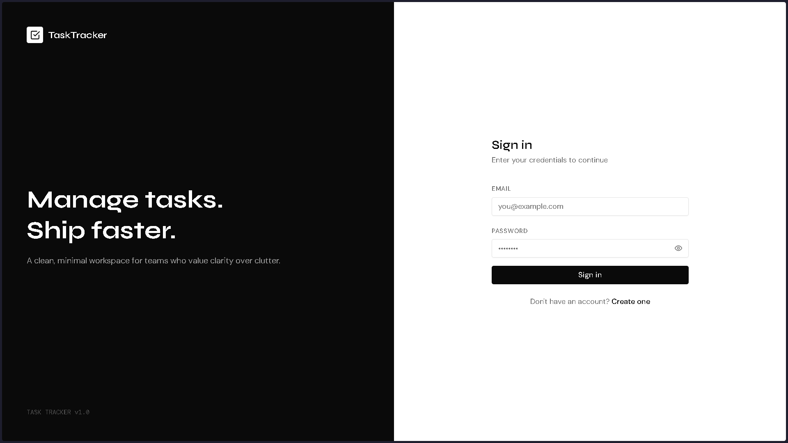
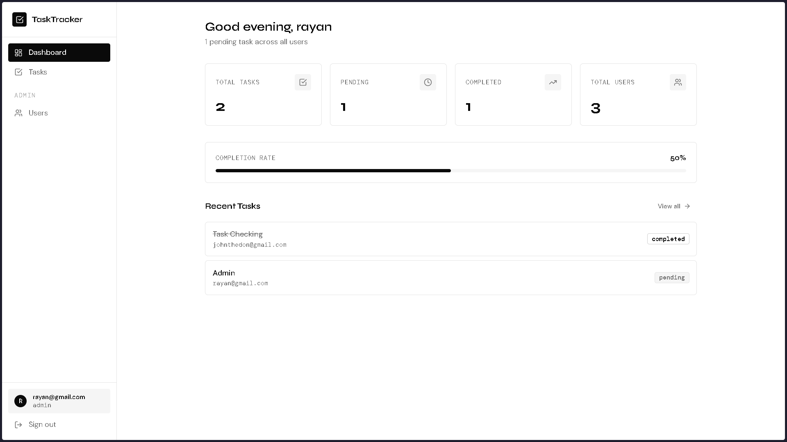
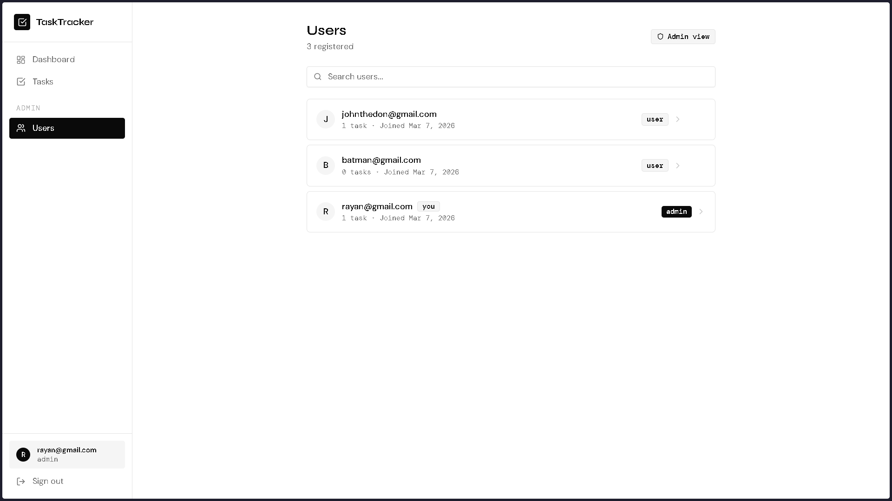
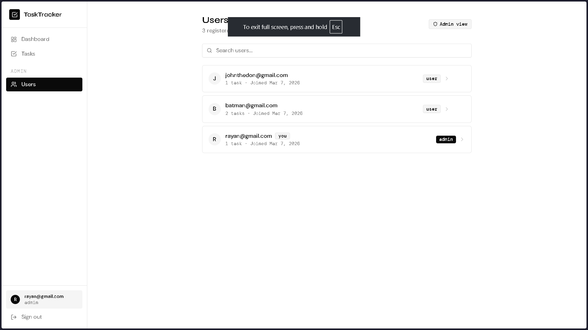

# Task Tracker — Frontend

A clean, minimal React frontend for the Task Tracker API. Built with React, Tailwind CSS, and shadcn-style components.

---

## Tech Stack

| Layer | Technology |
|-------|-----------|
| Framework | React 18 |
| Routing | React Router v6 |
| Styling | Tailwind CSS |
| Components | shadcn-style (Radix primitives) |
| HTTP Client | Axios |
| Icons | Lucide React |
| Testing | Jest + React Testing Library |
| Build Tool | Vite |

---

## Features

- Register and login with JWT authentication
- Protected routes — redirect to login if unauthenticated
- Dashboard with task stats and completion rate
- Full task CRUD — create, view, edit, delete, toggle status
- Search and filter tasks by status
- Admin dashboard — view and delete all users
- Toast notifications for all actions
- Responsive layout with sidebar navigation
- Client-side form validation with real-time password strength indicator

---

## Setup

### Prerequisites

- Node.js v18+
- Backend API running (see `../server/README.md`)

### 1. Install dependencies

```bash
cd client
npm install
```

### 2. Configure environment variables

```bash
cp .env.example .env
```

Open `.env`:
```env
VITE_API_URL=http://localhost:3000/api/v1
```

### 3. Start the development server

```bash
npm run dev
```

App runs at `http://localhost:5173`

---

## Running Tests

```bash
npm test
```

---

## Project Structure

```
client/
├── src/
│   ├── App.jsx                    # Router and providers
│   ├── main.jsx                   # Entry point
│   ├── index.css                  # Global styles + design tokens
│   ├── lib/
│   │   ├── api.js                 # Axios instance with JWT interceptors
│   │   └── utils.js               # cn() utility
│   ├── context/
│   │   └── AuthContext.jsx        # Global auth state
│   ├── components/
│   │   ├── ui/                    # Reusable UI components
│   │   ├── layout/
│   │   │   └── AppLayout.jsx      # Sidebar + navigation
│   │   └── common/
│   │       └── ProtectedRoute.jsx # Auth guard
│   └── pages/
│       ├── LoginPage.jsx
│       ├── RegisterPage.jsx
│       ├── DashboardPage.jsx
│       ├── TasksPage.jsx
│       └── UsersPage.jsx
├── tests/
│   ├── components.test.jsx
│   └── login.integration.test.jsx
├── .env.example
└── README.md
```

---

## Security Notes

- JWT token stored in `localStorage` and attached to every API request via Axios interceptor
- 401 responses automatically clear the token and redirect to login
- No API URLs hardcoded — all configured via environment variables
- Admin-only routes protected at the router level

## Screenshots

### Login


### Dashboard (Admin)


### Tasks


### Users (Admin)
